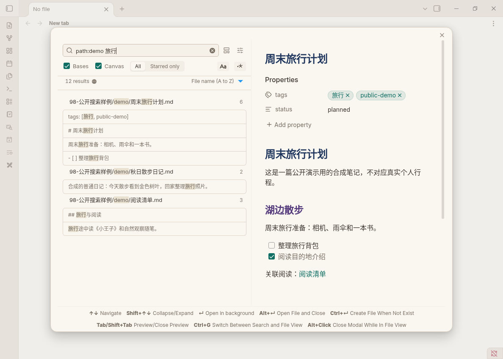
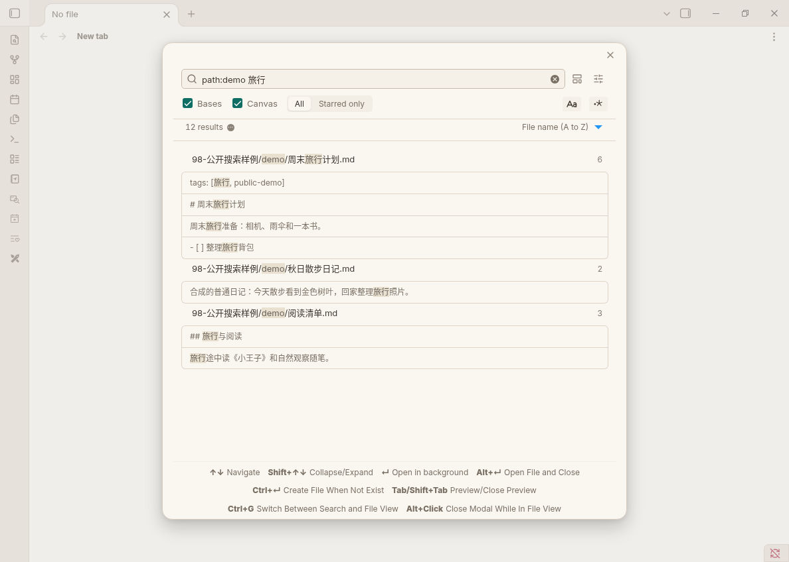
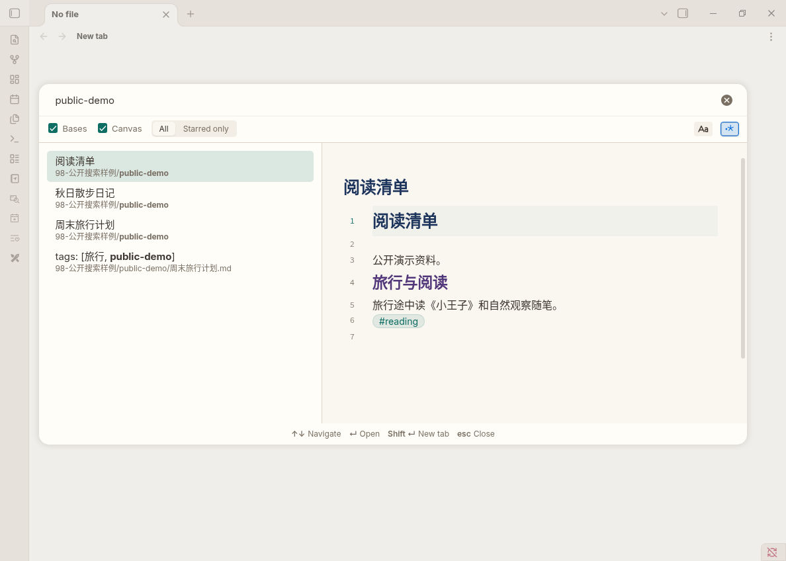

<p align="center">
  
</p>

<p align="center">
  <a href="README.md"></a>
  <a href="README_en.md"></a>
  <a href="https://github.com/AiurArtanis/Obsidian-Float-Search-Window/stargazers"></a>
  <a href="https://github.com/AiurArtanis/Obsidian-Float-Search-Window/network/members"></a>
  
  <a href="LICENSE"></a>
  <a href="https://github.com/AiurArtanis/Obsidian-Float-Search-Window/releases"></a>
  
  
</p>

# Float Search Window

Use Obsidian's built-in search view in a floating modal, split, tab, or pop-out window. This repository continues maintenance for Windows and Chinese IME.

[中文](README.md) | [English](README_en.md)

This repository is a fork of [Quorafind/Obsidian-Float-Search](https://github.com/Quorafind/Obsidian-Float-Search) by [Boninall](https://github.com/Quorafind). The original author is no longer maintaining it. This line continues from upstream 4.3.0. Please star the upstream repo as well. Open issues here first.

## 📖 Table of Contents

- [Demo](#demo)
- [Features](#-features)
- [What's new vs upstream](#whats-new-vs-upstream)
- [Install](#-install)
- [Usage](#usage)
- [Shortcuts](#️-shortcuts)
- [Settings](#settings)
- [Acknowledgements](#-acknowledgements)
- [License](#license)
- [Star](#-star)

## Demo

Floating search modal (public synthetic examples in dot-work, not real personal plans):

<p align="center">
  
</p>

## ✨ Features

- Open native Obsidian search in a modal, sidebar, split, tab, or window
- Double-tap `Shift` (configurable) for CMDK quick search across files, headings, and content, with preview
- Wait until IME composition ends before searching, so Chinese input is not interrupted
- Filter by Bases and Canvas, or limit results to starred notes
- Match case and regular expressions (VS Code-style icon toggles)
- Preview a hit on the right of the modal before choosing where to open it
- Right-click selected text to search
- Launch from outside with `obsidian://fs?query=keyword`
- Optionally create a timestamped note from the quick-search query

## What's new vs upstream

Added on top of [Floating Search 4.3.0](https://github.com/Quorafind/Obsidian-Float-Search):

| Item | What it does |
|---|---|
| Chinese IME | Do not query while composing, so pinyin is not swallowed or reordered |
| zh / en UI | Follows the Obsidian language for settings, commands, and key hints |
| Tabbed settings | General / Quick Search / Quick Create |
| Multi-filters | Bases and Canvas checkboxes; All / Starred only segment; Aa and regex |
| Separate plugin id | `float-search-window`, so the official `float-search` is not overwritten |

Filter row on the global search modal (dot-work example search):

<p align="center">
  
</p>

The same row on the quick-search palette (double-tap Shift; dot-work example search):

<p align="center">
  
</p>

## 📦 Install

This repo is not in the official community plugin list. The plugin id is `float-search-window`, so it does not overwrite the official Floating Search (`float-search`).

### BRAT

1. Install [BRAT](https://github.com/TfTHacker/obsidian42-brat)
2. Add `AiurArtanis/Obsidian-Float-Search-Window`
3. Enable **Float Search Window**, and disable the official **Floating Search** if it is still on

### Manual

1. Download `main.js`, `manifest.json`, and `styles.css` from [Releases](https://github.com/AiurArtanis/Obsidian-Float-Search-Window/releases)
2. Put them in `{vault}/.obsidian/plugins/float-search-window/`
3. Reload installed plugins, then enable it

## Usage

### Commands

| Command | What it does |
|---|---|
| Search obsidian globally | Global search; clears the query each time |
| Search Obsidian Globally (With Last State) | Global search; keeps the last query for about 30 seconds |
| Search in current file | Search only the current file |
| Search in backlink Of current file | Search backlinks to the current file |
| Open search view (split / tab / window) | Open search in a split, tab, or window |
| Show/hide file path | Toggle paths in results |

Commands have no default hotkeys. Bind them under **Settings → Hotkeys** by searching `Float Search`.

### Inside the modal

While the search input is focused:

- `↑` `↓` move between results; `Shift+↑/↓` expand or collapse
- `Enter` opens in the background; `Ctrl+Enter` opens in a new background tab; `Alt+Enter` opens and closes the modal
- `Ctrl+Shift+Alt+Enter` opens in a new window and closes the modal
- `Tab` previews on the right; `Shift+Tab` closes the preview
- `Ctrl+Shift+C` copies the current result
- While previewing, `Ctrl+E` toggles reading view; `Ctrl+G` jumps between the input and the preview

With a preview open, clicking a result only switches the preview; `Alt+click` opens and closes the modal. With no preview, a click opens the file and closes the modal.

### URI

```
obsidian://fs?query=hello
obsidian://fs?query=world&viewType=tab
```

`viewType` can be `modal` (default), `sidebar`, `split`, `tab`, or `window`.

## ⌨️ Shortcuts

| Action | Default | Notes |
|---|---|---|
| Open CMDK quick search | Double-tap `Shift` | Change to Ctrl / Alt / Meta, or disable, in settings |

See the previous section for in-modal keys. Command hotkeys are unbound by default.

<details>
<summary><strong>Full in-modal keymap</strong></summary>

| Key | Action |
|---|---|
| `↑` `↓` | Move between results |
| `Shift+↑/↓` | Expand / collapse |
| `Enter` | Open in background |
| `Ctrl+Enter` | Open in a new background tab |
| `Alt+Enter` | Open and close the modal |
| `Ctrl+Shift+Alt+Enter` | Open in a new window and close |
| `Tab` / `Shift+Tab` | Open / close preview |
| `Ctrl+Shift+C` | Copy result |
| `Ctrl+E` | Toggle preview reading view |
| `Ctrl+G` | Jump input ↔ preview |
| `Alt+click` | Open and close the modal |

</details>

## Settings

- **General**: default view, show file path, show key hints
- **Quick Search**: which key double-tap opens CMDK, and the max gap between presses (default 300ms)
- **Quick Create**: create a note from the query when there is no exact match, plus folder and timestamp title format

## 🙏 Acknowledgements

- [Boninall / Quorafind](https://github.com/Quorafind) and [Obsidian-Float-Search](https://github.com/Quorafind/Obsidian-Float-Search)
- Embedded leaf implementation from [obsidian-hover-editor](https://github.com/nothingislost/obsidian-hover-editor)

## License

[GPL-3.0](LICENSE). See [NOTICE](NOTICE) for copyright and upstream credit.

## ⭐ Star

If this project helps you, please star the repository.
